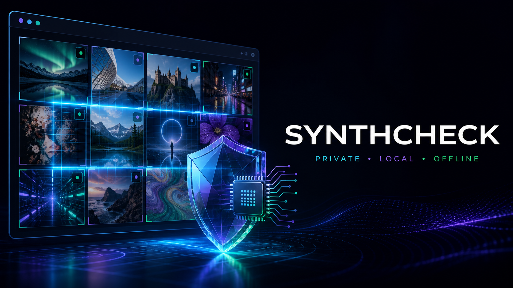

# SynthCheck



SynthCheck is an MIT-licensed Chrome extension that estimates whether images on ordinary webpages are AI-generated. Image decoding, preprocessing, and ONNX inference run inside Chrome; pixels and image-derived features are never uploaded to an inference service.

> **Submission status:** the exact 22 MB browser artifact scores **77.6% balanced accuracy** at the required displayed 65% threshold on a frozen 1,000-image diagnostic sample. That clears the bounty's 75.0% public development gate, but only the maintainers' private benchmark can determine whether a claim qualifies.

## Capabilities

- Native Manifest V3 extension using a service worker and durable offscreen inference document.
- Checksum-verified, MIT-licensed Community Forensics ViT-S/16 weights bundled with the extension; no model network request is required.
- Automatic viewport-prioritized analysis of eligible `` elements, including lazy and dynamically added images.
- An AI-likelihood score on every successful analysis, with scores at or above 65% flagged as likely AI-generated.
- Explicit unavailable states, duplicate-result caching, per-site pause, label visibility, and page re-scan controls.
- Unit, manifest, build, benchmark, and disposable-Chrome offline/restart tests.

SynthCheck is a screening aid, not proof that an image is authentic or synthetic.

## Requirements

- Node.js 20.9 or newer for development, benchmarking, and building only.
- Google Chrome 121 or newer for the unpacked production extension.

Node.js, Python, localhost services, accounts, and internet access are not required by the installed extension. Network access is required only to clone the repository and install pinned build dependencies.

## Reproducible build

```sh
npm ci
npm run verify
```

The unpacked extension is created in `dist/`. The build copies the pinned ONNX model, ONNX Runtime Web, and WASM runtime into the extension. Its content security policy prohibits remotely hosted code.

## Install in Chrome

1. Run the reproducible build above.
2. Open `chrome://extensions`.
3. Enable **Developer mode**.
4. Select **Load unpacked** and choose `dist/`.
5. On the SynthCheck setup page, select **Prepare verified model** and wait for **Offline ready**.
6. Visit an ordinary webpage. Eligible images at least 64×64 pixels receive a label as they approach the viewport.

Setup verifies the bundled model's SHA-256 digest before storing it in browser IndexedDB. The artifact and its conversion recipe are source-controlled; see [model provenance](docs/model-provenance.md).

## Verification

Run lint, type checking, unit tests, and the production build:

```sh
npm run verify
```

Run the clean-profile browser test:

```sh
npx playwright-core install chromium
npm run test:chrome
```

The Chrome test prepares and verifies the bundled model, restarts the browser, disables networking, analyzes an embedded image, and requires a numeric result label.

Benchmark preparation and reproduction instructions are in [benchmark/README.md](benchmark/README.md). The checked-in [quantized diagnostic report](benchmark/results/community-forensics-int8-test.json) records the model, calibration, dataset manifest, runtime, threshold, and source-level metrics.

For evidence, known limitations, and the manual POIDH claim procedure, see the [submission-readiness report](docs/submission-readiness.md).

## Privacy and network behavior

- Inference never calls a cloud API or localhost service.
- Rendered image pixels are captured into a local aspect-preserving snapshot when page security permits.
- If direct capture is unavailable, the extension may retrieve the image from its existing source URL using Chrome host permissions. This is a download from the page's source, never an upload to SynthCheck or another inference service.
- No model, code, weight, telemetry, or inference asset is fetched after installation—or during setup, because the model is bundled.
- SynthCheck has no analytics, account, or browsing-history synchronization.

## Known limitations

- Cross-origin policy, authenticated URLs, canvas/WebGL content, CSS backgrounds, SVG edge cases, and video frames can prevent access to pixels; the UI reports unavailable analyses rather than inventing scores.
- Very small images under 64×64 are excluded as non-content UI assets.
- Detection quality varies by generator and transformation. The diagnostic report is weakest on SD3 and Midjourney 6, and the private bounty result may differ.

## License

SynthCheck source and the bundled Community Forensics model are available under MIT licenses. Third-party runtime and research provenance are documented in [docs/model-provenance.md](docs/model-provenance.md).
